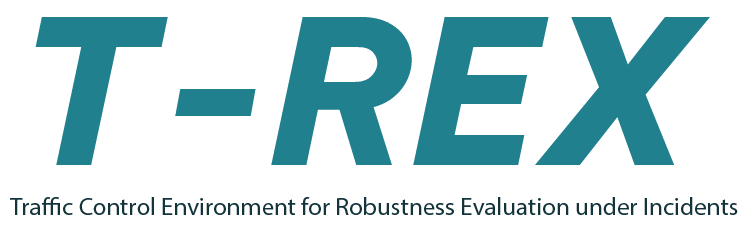

# 🚦 T-REX – Traffic Control Environment for Robustness Evaluation under Incidents

T-REX is an open-source simulation framework for training and evaluating **Reinforcement Learning-based Traffic Signal Control (RL-TSC)** under **network-level incident scenarios**. Built on top of [SUMO](https://www.eclipse.org/sumo/), T-REX enables **realistic and reproducible** simulation of dynamic disruptions like accidents, lane blockages, and rerouting behavior to assess the **robustness of control strategies**.

> Designed for researchers and practitioners seeking robust traffic signal control under uncertainty.

📖 **[Documentation (Coming Soon)]** | 🚀 **Quickstart** | 💡 **Use Cases** | 🧪 **Benchmarking Scenarios**

---

<p align="left">
  
</p>

## 🎯 Key Features

✅ **Incident-Aware Simulation** – Integrates random or user-defined incidents with duration, location, and lane impact.  
✅ **Realistic Driver Behavior** – Includes rerouting via the Information Comply Model (ICM), speed adaptation, and lane-change reactions.  
✅ **RL-Compatible** – Interfaces with any RL algorithm using [RESCO](https://github.com/Pi-Star-Lab/RESCO) and OpenAI Gym.  
✅ **Network-Level Evaluation** – Supports large-scale simulations with dynamic congestion propagation.  
✅ **Modular Design** – Separate Initializer, Deployment, and RL interfaces for flexibility.  
✅ **Robustness Metrics** – Includes learning stability, performance degradation, convergence rate, and AUC comparisons.

---

## 🚀 Quickstart

```bash
# Clone the repository
git clone https://github.com/andngdtudk/T-REX.git
cd T-REX

# Set up environment (SUMO + Python)
conda env create -f environment.yml
conda activate trex

# Run a base scenario
python main.py --agent IDQN --map grid4x4 --eps 100 --tr 0 --strategy 1

# Run an incident scenario
python main.py --agent IDQN --map grid4x4 --eps 100 --tr 0 --strategy 2
```

✔ Results stored in `T-REX/results/{scenario_name}/`

---

## 🧰 Installation

### 1️⃣ Dependencies

- [SUMO](https://www.eclipse.org/sumo/)
- Python ≥ 3.8
- TraCI (Python API for SUMO)
- OpenAI Gym
- Set LIBSUMO_AS_TRACI to any value and give main.py --libsumo True
- Pytorch
- Tensorflow
- Pfrl
- Sumolib

```bash
# Install SUMO (example using apt)
sudo apt-get install sumo sumo-tools sumo-doc

# Install Python dependencies
pip install -r requirements.txt
```

---

## 🧠 RL Integration

T-REX uses **RESCO** to interface with reinforcement learning agents. The environment exposes:

- **State:** per-intersection traffic observations (e.g., queue length, pressure, incoming flow)
- **Action:** signal phase decisions (discrete)
- **Reward:** delay, throughput, or custom metrics

Supports algorithms like:
- IDQN
- IPPO
- MPLight
- FMA2C
- + any custom method using Gym interface

---

## 🔥 Incident Modeling

T-REX supports two modes of incident deployment:
- **Collision simulation** using real-time vehicle manipulation
- **Virtual blockage** using dummy vehicles (recommended)

Features:
- Configurable duration, location, number of blocked lanes
- Random or deterministic generation
- Anti-teleportation strategies
- Supports multiple simultaneous incidents

---

## 🚘 Driver Behavior Modules

- **Rerouting:** Based on the Information Comply Model (ICM), including awareness via radio, VMS, apps, and observation.
- **Speed adaptation:** Slowdown based on stopping sight distance (SSD)
- **Lane changing:** Enhanced behavior using modified SUMO lane change model (LC2013)

---

## 📊 Robustness Evaluation

T-REX offers multiple metrics beyond average travel time:

| Metric | Description |
|--------|-------------|
| `Performance Degradation (P)` | Relative drop from base to incident scenario |
| `Learning Stability Index (LSI)` | Variation in learning curve |
| `Final Performance Deviation (FPD)` | Drop from best to final episode |
| `Convergence Rate (CR)` | Speed and direction of convergence |
| `Relative AUC Difference (RAUC)` | Difference in total performance over time |

---

## 🧪 Benchmark Networks

T-REX includes five traffic networks:

| Scenario | Description |
|----------|-------------|
| Grid4x4 | 16-intersection synthetic network |
| Cologne Corridor | 3 intersections (TAPAS) |
| Cologne Region | 8 intersections (TAPAS) |
| Ingolstadt Corridor | 7 intersections |
| Ingolstadt Region | 21 intersections (realistic large-scale case)

---

## 📂 Folder Structure

```bash
├── TREX_comp/
│   ├── __pycache__/
│   ├── agents/
│   ├── config/
│   ├── rewards.py
│   └── states.py
│
├── environments/
│   ├── arterial4x4/
│   ├── cologne1/
│   ├── cologne3/
│   ├── cologne8/
│   ├── grid4x4/
│   ├── ingolstadt1/
│   ├── ingolstadt7/
│   ├── ingolstadt21/
│   └── LICENSE
│
├── README.md
├── T_REX.py
├── T_REX_logo.jpg
├── base_env.py
├── incident_env.py
├── main.py
├── requirements.txt
└── traffic_signal.py
```

---

## 🙏 Acknowledgments
This project incorporates components from the open-source RESCO repository (https://github.com/Pi-Star-Lab/RESCO/tree/main) developed by Pi-Star Lab. 
RESCO provides a Gym-compatible benchmarking environment for RL-based traffic signal control on SUMO, which has been adapted or extended in this work.
We thank the authors for their valuable contribution to the research community.

## 🤝 Contributing

We welcome community contributions!

1. Fork the repo and create a new branch
2. Submit a pull request after testing with:
```bash
python tests/run_all_tests.py
```

---

## 📢 Citation

If you use T-REX in your research, please cite:

```bibtex
@misc{nguyen2025robustnessreinforcementlearningbasedtraffic,
      title={Robustness of Reinforcement Learning-Based Traffic Signal Control under Incidents: A Comparative Study}, 
      author={Dang Viet Anh Nguyen and Carlos Lima Azevedo and Tomer Toledo and Filipe Rodrigues},
      year={2025},
      eprint={2506.13836},
      archivePrefix={arXiv},
      primaryClass={cs.LG},
      url={https://arxiv.org/abs/2506.13836}, 
}
```
