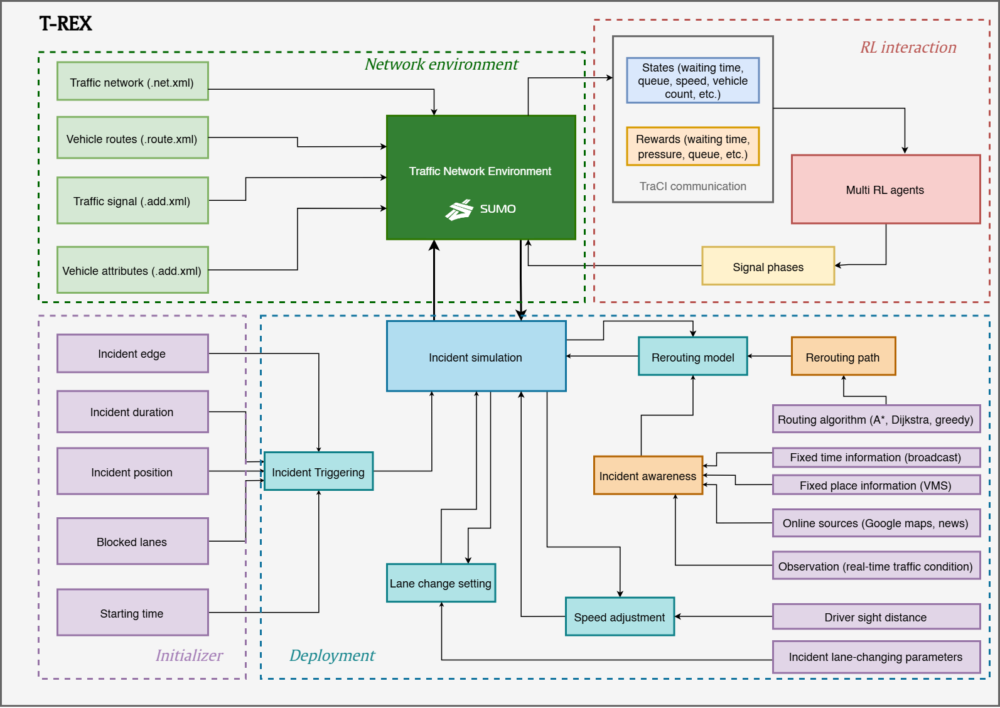

# T-REX

<p align="left">
  
</p>


[](https://arxiv.org/abs/2506.13836)

**T-REX** (Traffic control Environment for Robustness Evaluation under incidents) is a
[SUMO](https://www.eclipse.org/sumo/)-based simulation framework for training and
evaluating Reinforcement-Learning-based Traffic Signal Control (RL-TSC) methods under
network-level incident conditions — collisions, lane blockages, stalled vehicles — rather
than only the free-flow conditions most RL-TSC benchmarks assume. It injects incidents
with configurable location/duration/severity, simulates realistic driver responses
(rerouting, speed adaptation, lane changing) around them, and exposes a Gym-compatible
interface so any RL-TSC method can be trained and evaluated on how much its performance
degrades when the network is disrupted.

> Companion code for *"Robustness of Reinforcement Learning-Based Traffic Signal Control
> under Incidents: A Comparative Study"* (see [Citation](#citation)).

**Before you rely on any number this repository produces**, read
[`AUDIT_REPORT.md`](AUDIT_REPORT.md) — an independent, six-round code audit. The paper-vs-code
numeric discrepancies it originally flagged (incident start-time sampling window, warm-up
duration, `slow_zone_speed`, SUMO/RL-exploration seed control) have since been confirmed
against the manuscript directly by the repo owner and fixed; the report's "Needs owner
decision" section is now down to two repo-policy items with no effect on reproducing
published numbers. Still worth reading before assuming a given run reproduces a specific
result — it also documents every bug found and fixed along the way.

## Key features

- **Incident-aware simulation** — inject a lane-blocking incident at a chosen or randomly
  sampled edge/position/lane-count/duration/start-time (Section 2.3).
- **Information Comply Model (ICM) rerouting** — a probabilistic, awareness-based model of
  whether and when a driver reroutes around a known incident (radio/VMS/app/observation
  awareness sources feeding a binomial-logit rerouting decision; Appendix A).
- **Stopping-Sight-Distance (SSD) speed adaptation** — vehicles approaching a blocked lane
  slow down once the incident is within their AASHTO stopping sight distance (Section 2.4.2).
- **Contextual lane-changing** — modified SUMO LC2013 lane-change parameters near an
  incident (Section 2.4.3).
- **Gym-compatible RL interface**, adapted from [RESCO](https://github.com/Pi-Star-Lab/RESCO),
  supporting **IDQN, IPPO, MPLight, FMA2C**, and rule-based baselines (Fixed-time, Random,
  Max-pressure, Greedy).
- **Modular by design** — the incident model (`Initializer`/`Deployment`) is decoupled from
  the RL interface, so it's meant to be portable to other traffic simulators or RL-TSC
  stacks, not only this repo's SUMO+RESCO integration.

## Architecture

T-REX is organized into four conceptual modules (the paper's Figure 1); in this repository
they map onto code as follows:

<p align="left">
  
</p>

| Module | Code |
|---|---|
| Network Environment | `trex_env.py`, `traffic_signal.py`, `environments/*` (SUMO network, routes, signal plans, vtypes) |
| Initializer | `T_REX.py::Initializer` — samples edge/lanes/position/duration/start time |
| Deployment | `T_REX.py::Deployment` — injects the incident via TraCI, runs ICM rerouting, SSD speed adaptation, and lane-changing each step |
| RL Interaction | `TREX_comp/` (`agents/`, `rewards.py`, `states.py`, `config/`) + `main.py` entry point |

`TrexEnv` (in `trex_env.py`) is the single Gym environment class that wires these together,
with incidents controlled by one constructor parameter, `incident_config`
(`TREX_comp/config/incident_config.py`): `None` disables incidents entirely — the
`Initializer`/`Deployment` subsystem is never constructed or invoked, not run-and-discarded
— while an `IncidentConfig(...)` enables them. Each episode with incidents enabled
constructs an `Initializer` (sampling or accepting fixed incident parameters) and, if an
incident is active, a `Deployment` that runs the rerouting/speed/lane-change logic once per
simulation step. `main.py` selects `IncidentConfig` vs. `None` from the existing
`--strategy` flag (1 = off, 2 = on) rather than adding a second toggle.

> `base_env.py`/`incident_env.py` (the pre-refactor `BaseEnv`/`IncidentEnv` classes) still
> work as thin, deprecated wrappers around `TrexEnv` for backward compatibility, but new code
> should use `TrexEnv` directly. See `trex_env.py`'s docstring and `AUDIT_REPORT.md` for what
> changed when they were merged (one real bug fixed: `BaseEnv`'s route-file path construction
> didn't match `IncidentEnv`'s/`main.py`'s, and was broken on `grid4x4`/`arterial4x4`).

## Installation

### 1. SUMO

Install [SUMO](https://www.eclipse.org/sumo/) and set `SUMO_HOME` to its installation
directory (required by `sumolib`/`traci`). This repository was developed and smoke-tested
against **SUMO 1.27**; older 1.19+ releases are likely compatible but haven't been verified.

```bash
# Debian/Ubuntu
sudo apt-get install sumo sumo-tools sumo-doc
export SUMO_HOME=/usr/share/sumo   # add to your shell profile
```

Alternatively, `pip install eclipse-sumo` (already in `requirements.txt`) bundles the SUMO
binaries as a Python package, which is what the CI/smoke-test environment for this audit
used.

### 2. Python environment

Python 3.10+ (tested on 3.13). Using a virtual environment is recommended:

```bash
python -m venv .venv && source .venv/bin/activate   # or: conda create -n trex python=3.11
pip install -r requirements.txt
```

To run libsumo (faster, in-process SUMO) instead of subprocess-based TraCI, set
`LIBSUMO_AS_TRACI=1` in your environment and pass `--libsumo True` to `main.py`
(this is `main.py`'s default). `libsumo` is pinned in `requirements.txt`, so a normal
install gets it automatically; `main.py` logs which backend actually ended up active
(`TraCI backend in use: libsumo (in-process)` / `traci (subprocess)`) at startup, since
`LIBSUMO_AS_TRACI` being set doesn't by itself guarantee `libsumo` is installed — if it
silently falls back, that log line is how you'd notice.

### 3. RESCO

`TREX_comp/` is a self-contained adaptation of [RESCO](https://github.com/Pi-Star-Lab/RESCO)'s
agent/environment interface (see `trex_env.py`'s module docstring) — you do **not** need to install RESCO
separately to train or evaluate with `main.py`. The `resco_benchmark` package is imported
only by the standalone analysis script `readXML.py`, which is not part of the training
pipeline; install it from source (`pip install git+https://github.com/Pi-Star-Lab/RESCO`)
only if you need that specific script.

### 4. Verify the install

```bash
# Decompress the grid4x4 traffic-flow files (only needed for grid4x4/arterial4x4)
cd environments/grid4x4 && unzip grid4x4.zip -d grid4x4 && cd ../..

export LIBSUMO_AS_TRACI=1
python main.py --agent MAXPRESSURE --map grid4x4 --eps 1 --strategy 1 --libsumo True
```

This runs one episode of a rule-based Max-pressure controller on Grid4x4 with no incidents
and writes `results/.../metrics_1.csv`. If it completes without a traceback, your SUMO/Python
setup is working. Run the unit tests as a second check (these don't need SUMO installed):

```bash
pip install -r requirements-dev.txt
pytest tests/
```

## Quick start

```bash
export LIBSUMO_AS_TRACI=1

# Max-pressure baseline on Grid4x4, no incidents
python main.py --agent MAXPRESSURE --map grid4x4 --eps 10 --strategy 1 --libsumo True

# Same, but with incidents injected (Initializer/Deployment active), seed-controlled
python main.py --agent MAXPRESSURE --map grid4x4 --eps 10 --strategy 2 --libsumo True --seed 0
```

`--strategy 1` constructs `TrexEnv(incident_config=None)` (no incidents); `--strategy 2`
constructs `TrexEnv(incident_config=IncidentConfig(level=2))` with randomly sampled
incidents each episode — one environment class either way, see Architecture above.
`--seed` (default `42`) seeds Python's `random`, `numpy`, `torch`, SUMO's own `--seed`
(offset per episode), and — separately — an independent RNG for the RL agent's own
exploration policy, decoupled from the RNG the incident sampler reseeds every episode (see
[Reproducibility](#reproducibility) below). Pass `--no-seed-sumo` to fall back to SUMO's
unseeded `--random` while still seeding everything else. **`--strategy 3` ("curriculum") is
present in the CLI help text but not yet implemented — it raises `NotImplementedError`
rather than running.**

Swap `--agent` for any of `STOCHASTIC`, `MAXWAVE`, `MAXPRESSURE`, `IDQN`, `IPPO`, `MPLight`,
`FMA2C`, and `--map` for `grid4x4`, `arterial4x4`, `ingolstadt1/7/21`, `cologne1/3/8`.
IDQN/IPPO/MPLight/FMA2C additionally require `torch`, `tensorflow`, and `pfrl` (all in
`requirements.txt`).

## Metrics & analysis

T-REX itself only produces **raw per-episode logs**; it does not compute the paper's
Section 3.4 robustness metrics (LSI, FPD, CR, AUC, RAUC, PDI) — those are computed by a
separate downstream analysis pipeline, not part of this repository. Each episode writes,
under `results/<connection_name>/` (`connection_name` encodes agent/trial/map/state/reward
function):

- **`metrics_<run>.csv`** — one line per environment `step()` (i.e. per RL decision):
  `step, reward, max_queues, queue_lengths`, where the latter three are `str()`-rendered
  Python dicts keyed by signal ID (e.g. `{'A0': 3, 'A1': 0, ...}`) — not standard
  one-value-per-column CSV. Written by `TrexEnv.calc_metrics`/`save_metrics` in `trex_env.py`.
- **`tripinfo_<run>.xml`** — SUMO's native per-vehicle
  [tripinfo output](https://sumo.dlr.de/docs/Simulation/Output/TripInfo.html)
  (`depart`/`arrival`/`duration`/`waitingTime`/`timeLoss`/etc. per vehicle), written
  directly by SUMO via `--tripinfo-output --tripinfo-output.write-unfinished`.

Whatever computes LSI/FPD/CR/AUC/RAUC/PDI for the paper consumes these two files (or their
aggregation) across a training run's episodes; see `readXML.py`/`graph.py` for example
ad hoc post-processing of `tripinfo_*.xml` (not part of the core pipeline — see Repository
structure below).

## Reproducing the paper's experiments

The paper reports three experiments (learning performance, testing/generalization, and
transferability/online adaptation) plus a Table 1 runtime/scalability benchmark. This
repository has a **single entry point** (`main.py`) rather than one script per experiment;
each experiment corresponds to a particular combination of CLI flags:

| Experiment | Flags | Notes |
|---|---|---|
| 1 — Learning performance | `--strategy 2 --agent <method> --map <network> --eps <N> --seed <s>` | Trains one RL-TSC method under incidents from scratch; repeat per method/network/seed. |
| 2 — Testing/generalization | `--strategy 2 --load True --agent <method> --map <network>` | Loads a trained model (`--load True`) and runs held-out episodes without further training. |
| 3 — Transferability/online adaptation | `--strategy 2 --repeat <N> --load True` | `--repeat` saves (during training) and later replays (during testing) a fixed set of the last `N` incident seeds, for evaluating a trained agent against a controlled, reproducible incident set — see `main.py::run_incident_scenario`. |
| Table 1 — runtime/scalability | any of the above | Wall-clock/episode is not separately instrumented in this repo; time your own runs per network. |

The paper's results are averaged over 5 random seeds — run each configuration with 5
different `--seed` values (e.g. `0`–`4`) and average externally.

**Known limitation, not a reproducibility issue**: the per-network learning-rate defaults
from Appendix B are only wired up for IDQN/MPLight (`TREX_comp/config/hyperparams.py`);
IPPO/FMA2C's hyperparameters live inline in their agent code instead of a per-network
config table — see `AUDIT_REPORT.md` for details. Separately, `--eps 1` (or any `--eps`
where `int(eps * 0.8) == 0`) crashes IDQN with a `ZeroDivisionError` inside its exploration
schedule — a pre-existing edge case in the train/test episode split, not something this
audit's changes introduced; use `--eps 2` or higher.

## Reproducibility

Every source of randomness in a training/eval run is now seed-controlled from one `--seed`
value, each independently of the others:

- **Incident sampling** (`Initializer`) — reseeds a global `numpy` RNG from a value derived
  from `--seed` at the start of each episode.
- **SUMO's own vehicle-level stochasticity** — `--seed <value + episode offset>` is passed
  to SUMO directly (instead of `--random`); pass `--no-seed-sumo` to opt back into SUMO's
  unseeded default.
- **RL agent exploration** (IDQN, MPLight, FMA2C) — draws from an independent
  `np.random.default_rng(seed)` `Generator`, decoupled from the incident sampler's RNG
  above, so reseeding one can't silently perturb the other. For IDQN and MPLight this covers
  the *entire* exploration decision (both the epsilon-vs-greedy coin flip and the resulting
  random action); see `AUDIT_REPORT.md` for how this was verified against the real
  production code paths, not assumed from the underlying library's documentation.
- **PyTorch/TensorFlow** model initialization — seeded via `torch.manual_seed(--seed)`.

Given the same `--seed`, a run is fully reproducible end to end; different seeds produce
genuinely different (but each internally reproducible) incident placement, SUMO vehicle
behavior, and agent exploration. See `AUDIT_REPORT.md`'s "Round 5 — Part B4" / "Round 6"
sections for the manuscript citation motivating this (Section 3.4, "averaged over five
random seeds") and the live/test evidence behind each claim above.

## Configuring incidents

`Initializer` supports two modes:

**Random sampling** (used by `TrexEnv` each episode when `incident_config` is set): edge (weighted by historical flow
data for Ingolstadt/Cologne networks, uniform otherwise), number of blocked lanes, position
along the edge (`U(10, edge_length−10)`), start time, and duration
(`~Exponential(rate=0.029)` minutes) are all drawn automatically — see `Initializer.random()`.

**Fixed/user-defined incident**, via `Initializer.set_incident(...)`:

```python
from T_REX import Initializer

incident = Initializer(map_name="grid4x4", run_num=0, scenario_folder="environments/grid4x4/grid4x4.net.xml",
                        warm_up_time=0, end_time=3600)
incident.set_incident(
    edge="A2A1",         # SUMO edge ID
    lanes=[0, 1],        # which lanes are blocked
    pos=150.0,           # position along the edge, in meters
    start_time=600,      # simulation second the incident begins
    duration=300,        # how many seconds it lasts
    is_incident=True,
)
```

Note: the current implementation models incidents as a single generic "N lanes of an edge
become impassable" mechanism — it does **not** have a selectable `incident_type` parameter
distinguishing the five categories the paper's Table B1 describes (collision, stalled
vehicle, roadworks, speed-reduction/environmental, signal malfunction). Any of those can be
*represented* by the generic mechanism above (e.g. a full-width blockage for a collision, a
single-lane blockage for a stalled vehicle), but there's no code-level switch to pick
between them — see `AUDIT_REPORT.md` Section 2.4b.

**Teleport exemption**: SUMO's default behavior is to "teleport" (remove and respawn) a
vehicle that's been stuck too long, which would otherwise silently un-block an incident or
erase a genuinely-queued vehicle from the simulation. Every incident-capable network's
`.add.xml` defines a `CAV4` vType (`timeToTeleport="-1"`) that queued vehicles are switched
to for the duration they're blocked, and an `IC` vType (also `timeToTeleport="-1"`) for the
incident's own blocking vehicle — this works identically across all 8 supported networks,
not just `ingolstadt21` where it was first implemented; see `AUDIT_REPORT.md` for the
per-network verification.

## Repository structure

```
T_REX.py                 Initializer + Deployment: incident sampling, ICM rerouting,
                          SSD speed adaptation, lane-changing, teleport-exemption
trex_env.py                Gym env (TrexEnv); incident_config=None/IncidentConfig(...)
                              selects --strategy 1/2
base_env.py, incident_env.py  Deprecated thin wrappers around TrexEnv, kept for backward
                              compatibility -- see their docstrings
traffic_signal.py          Per-intersection Signal class (phases, observations)
main.py                    CLI entry point / training loop
graph.py, readCSV.py,       Ad hoc analysis/plotting scripts (not part of the core pipeline;
readXML.py                  readXML.py needs a separately-installed RESCO, see Installation)
TREX_comp/
  agents/                   RL-TSC method implementations (IDQN, IPPO, MPLight, FMA2C,
                              Max-pressure, Greedy/MAXWAVE, Random/STOCHASTIC)
  config/                    agent_config.py, map_config.py, mdp_config.py, signal_config.py,
                              hyperparams.py (per-network learning-rate defaults),
                              incident_config.py (IncidentConfig schema + example configs)
  rewards.py, states.py      Reward functions and observation functions per method
environments/               SUMO network/route/additional files per benchmark network
tests/                      pytest unit tests (SSD, ICM, incident sampling, env-unification
                              regression) -- most need no SUMO; the unification regression
                              test and a live smoke test require it, and skip otherwise
.github/workflows/ci.yml    CI: pytest (required) + ruff/black/isort (advisory)
AUDIT_REPORT.md             Independent code audit: findings, fixes, and open issues
CHANGELOG.md                What changed in the audit, by phase
```

## Supported networks

All 8 below work with both `--strategy 1` (base) and `--strategy 2` (incidents), including
the `CAV4`/`IC` teleport exemption described above.

| Network | Source |
|---|---|
| `grid4x4` | Synthetic 4×4 grid, 16 intersections — one of the paper's four evaluation networks |
| `cologne3` (Corridor) / `cologne8` (Region) | [TAPAS Cologne](https://sumo.dlr.de/docs/Data/Scenarios/TAPASCologne.html) — paper evaluation networks |
| `ingolstadt7` (Corridor) / `ingolstadt21` (Region) | [InTAS](https://github.com/silaslobo/InTAS) — paper evaluation networks |
| `cologne1`, `ingolstadt1` | Single-intersection reductions of the above, useful for quick local testing; not used in the paper |
| `arterial4x4` | Synthetic 4×4 arterial network, from RESCO's benchmark suite — **retained in the repo but not part of the paper's published experiments** (confirmed against the manuscript; kept for extensibility, not evidence of paper coverage) |

`arterial5x5`/`turin5` also appear in `TREX_comp/config/map_config.py` but aren't reachable
via `--map` (not in `main.py`'s argparse choices) and ship with no network data —
inherited-but-unused RESCO config, not a usable network; see `AUDIT_REPORT.md` if you want
to resurrect one.

To add a new network: add a `.sumocfg`/`.net.xml` (+ `.add.xml` if you need incident vTypes
like `CAV1`/`CAV3`/`IC`) under `environments/<name>/`, and an entry in
`TREX_comp/config/map_config.py` (step length, yellow length, start/end time, warm-up).
`signal_configs` in `TREX_comp/config/signal_config.py` needs a `phase_pairs`/`valid_acts`
entry if you intend to use MPLight/FMA2C on it.

## Extending T-REX

- **New RL-TSC method**: add an agent class under `TREX_comp/agents/` (see `agent.py` for the
  `Agent`/`IndependentAgent`/`SharedAgent` base classes), a reward function in `rewards.py`
  and/or state function in `states.py` if it needs a custom MDP, and an entry in
  `TREX_comp/config/agent_config.py`.
- **A different simulator**: the incident model (`Initializer`/`Deployment` in `T_REX.py`)
  is designed to be decoupled from the RL interface — porting it means reimplementing the
  small set of TraCI calls it makes (vehicle position/speed/route/type queries and
  edits) against your simulator's equivalent API; the sampling distributions, ICM/SSD math,
  and lane-change parameter logic don't otherwise depend on SUMO.

## Citation

```bibtex
@misc{nguyen2025robustnessreinforcementlearningbasedtraffic,
      title={Robustness of Reinforcement Learning-Based Traffic Signal Control under Incidents: A Comparative Study},
      author={Dang Viet Anh Nguyen and Carlos Lima Azevedo and Tomer Toledo and Filipe Rodrigues},
      year={2025},
      eprint={2506.13836},
      archivePrefix={arXiv},
      primaryClass={cs.LG},
      url={https://arxiv.org/abs/2506.13836},
}
```

This paper has been submitted to *European Transport Research Review*; journal
volume/pages/DOI are not yet assigned (TBD — see `CITATION.cff`). The arXiv preprint above
is the citable version in the meantime.

## License

The T-REX source code is released under the [MIT License](LICENSE). The traffic network
datasets under `environments/` are third-party research data redistributed under their own
licenses — see `environments/LICENSE` and the per-network Creative Commons notices.

## Acknowledgments

This project incorporates components adapted from the open-source
[RESCO](https://github.com/Pi-Star-Lab/RESCO) repository (Pi-Star Lab), which provides a
Gym-compatible benchmarking environment for RL-based traffic signal control on SUMO. Thanks
to the authors for their contribution to the research community.

## Contact / maintainers

For bugs or questions, please open a [GitHub issue](https://github.com/andngdtudk/T-REX/issues).
See `CONTRIBUTING.md` for how to submit a pull request.
